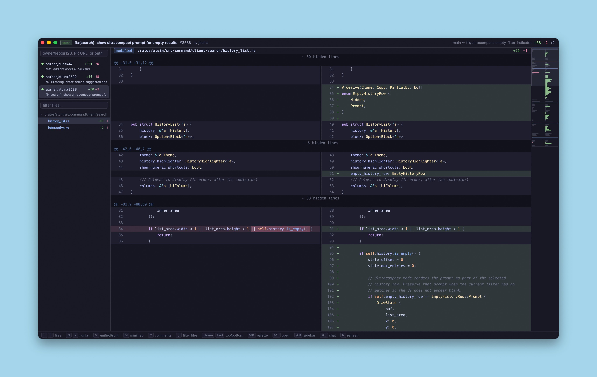

# lgtm

A fast, native code-review app in Rust, built with [gpui](https://www.gpui.rs/).

Requires the [GitHub CLI](https://cli.github.com/) (`gh auth login` first), otherwise you can only review code locally.

This is 100% vibe coded. I have not read the code. 

## Features
- unified + split views
- tree-sitter highlighting (18 languages),
- word-level intra-line diffs, 
- multi-item sidebar with file tree
- cmd-k palette with fuzzy PR picker, 
- local repo diffs
- minimap,
- inline GitHub review comments (reading + posting, hover a line for +)

Coming: LSP, AI inline review annotations

## Keymap
| Key | Action |
|---|---|
| `cmd-k` | open palette (GitHub PR picker / folder) |
| `cmd-t` / `cmd-w` / `cmd-b` | quick-open input / close item / toggle sidebar |
| `ctrl-tab` | cycle open items |
| `]` / `[` | next / previous file |
| `n` / `p` | next / previous hunk |
| `v` | unified ↔ split view |
| `/` | fuzzy file filter |
| `m` | toggle minimap |
| `c` | toggle inline comments |
| `cmd-j` | chat with Claude Code |
| `r` | refresh active item |
| `home` / `end` | top / bottom |
| `cmd-c` | copy selection |
| `cmd-q` | quit |

